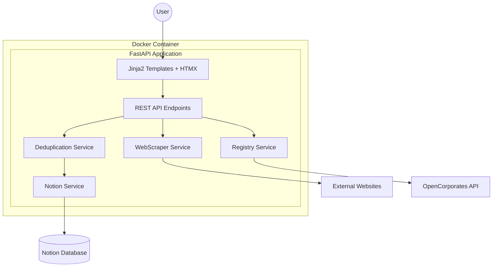
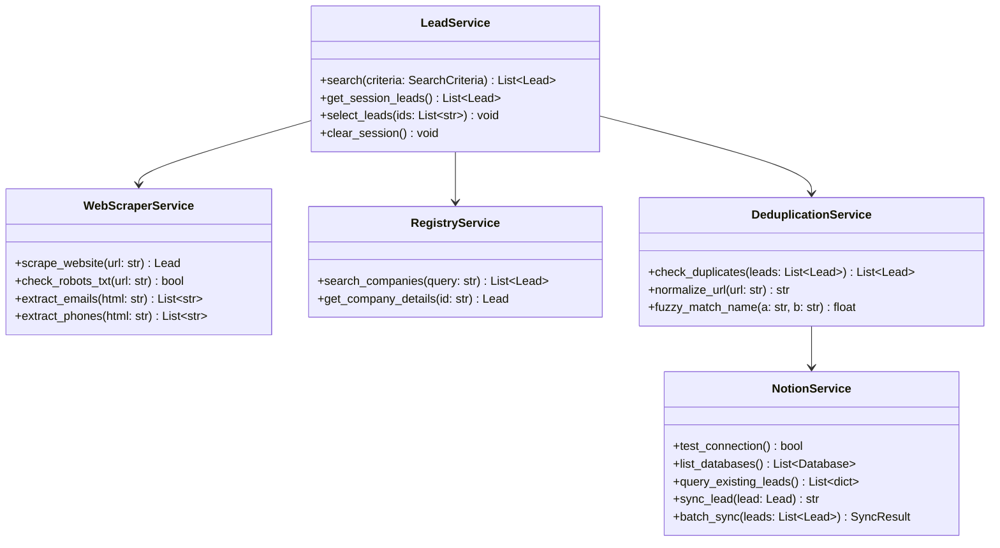
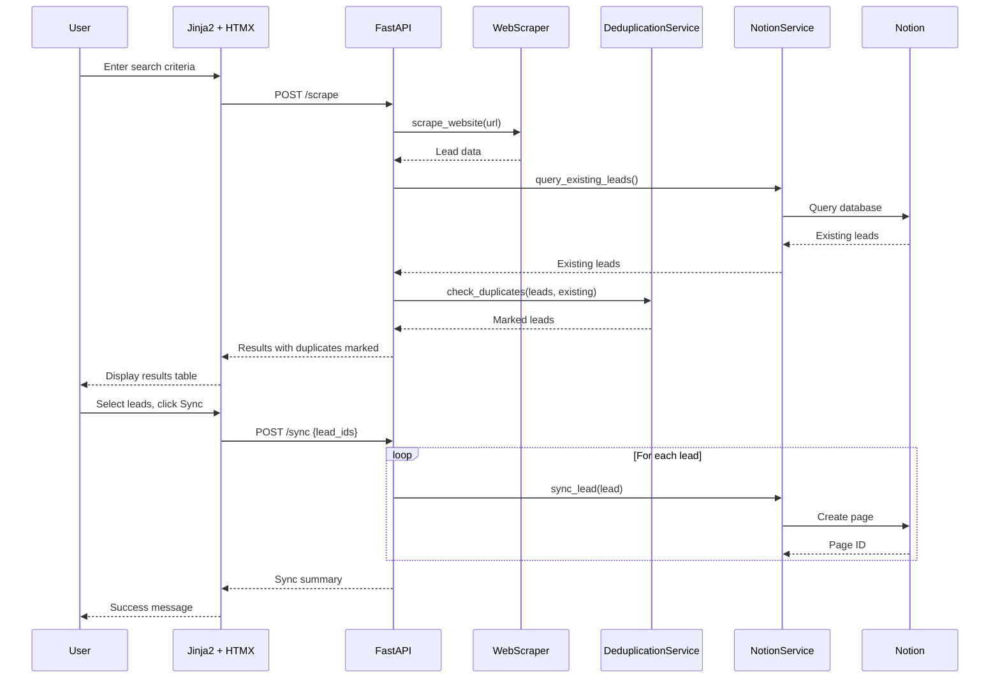

# Lead Scraper Architecture Document

---

## 1. Introduction

### 1.1 Purpose

This document defines the technical architecture for Lead Scraper, a Dockerized, local-first application that replaces expensive lead database subscriptions ($100-500+/month) with a $0 self-hosted solution. The system scrapes public data sources, extracts lead information, and syncs directly to the user's Notion database with intelligent deduplication.

### 1.2 Scope

This architecture covers:
- Python monolith with FastAPI + Jinja2 + HTMX
- Async web scraping with httpx and BeautifulSoup4
- Notion API integration as the sole data store
- Deduplication engine with fuzzy matching
- Docker deployment for local execution

### 1.3 Definitions and Acronyms

| Term | Definition |
|------|------------|
| HTMX | HTML extensions for AJAX without JavaScript |
| SSR | Server-Side Rendering |
| Lead | A company record with contact information |
| Deduplication | Process of identifying and preventing duplicate entries |

---

## 2. High-Level Architecture

### 2.1 System Overview



### 2.2 Architecture Principles

1. **Monolith-First**: Single deployable unit reduces operational complexity
2. **Server-Side Rendering**: Jinja2 + HTMX for minimal JavaScript footprint
3. **Notion as Source of Truth**: No local database, Notion handles persistence
4. **Async-First**: All I/O operations use async/await patterns
5. **Ethical Scraping**: robots.txt compliance, rate limiting, respectful delays

### 2.3 Key Design Decisions

| Decision | Rationale |
|----------|-----------|
| No local database | Notion serves as sole data store; eliminates sync complexity |
| HTMX over SPA | Simpler architecture, faster development, SSR benefits |
| Session-based state | Results stored in server session during workflow |
| Pydantic models | Type safety, validation, serialization in one package |

---

## 3. Technology Stack

### 3.1 Core Stack

| Component | Technology | Version | Purpose |
|-----------|------------|---------|---------|
| Runtime | Python | 3.13.x | Latest stable with LTS until 2029 |
| Framework | FastAPI | 0.128.6 | Async web framework with auto-docs |
| ASGI Server | Uvicorn | 0.40.0 | High-performance async server |
| HTML Parsing | BeautifulSoup4 | 4.14.3 | Robust HTML/XML parsing |
| HTTP Client | httpx | 0.28.1 | Async HTTP with modern API |
| Notion SDK | notion-client | 2.7.0 | Official Notion API wrapper |

### 3.2 Frontend Stack

| Component | Technology | Purpose |
|-----------|------------|---------|
| Templates | Jinja2 | Server-side HTML rendering |
| Interactivity | HTMX | AJAX without JavaScript |
| Styling | Pico CSS | Classless CSS framework |

### 3.3 Infrastructure

| Component | Technology | Purpose |
|-----------|------------|---------|
| Container | Docker | Local deployment, reproducibility |
| Orchestration | Docker Compose | Multi-service coordination |
| Logging | structlog | Structured JSON logging |

---

## 4. Data Models

### 4.1 Core Domain Models

```python
from pydantic import BaseModel, EmailStr, HttpUrl
from typing import Optional
from enum import Enum

class DataSource(str, Enum):
    WEBSITE = "website"
    REGISTRY = "registry"

class SyncStatus(str, Enum):
    PENDING = "pending"
    SYNCED = "synced"
    DUPLICATE = "duplicate"
    FAILED = "failed"

class Lead(BaseModel):
    """Core lead entity extracted from sources"""
    id: str  # UUID
    company_name: str
    website: Optional[HttpUrl] = None
    email: Optional[EmailStr] = None
    phone: Optional[str] = None
    industry: Optional[str] = None
    services: Optional[str] = None
    description: Optional[str] = None
    source_url: HttpUrl
    data_source: DataSource
    sync_status: SyncStatus = SyncStatus.PENDING
    is_duplicate: bool = False
    duplicate_of: Optional[str] = None  # Notion page ID

class SearchCriteria(BaseModel):
    """User search parameters"""
    url: Optional[HttpUrl] = None
    keywords: Optional[str] = None
    industry: Optional[str] = None
    location: Optional[str] = None
    company_size: Optional[str] = None

class NotionFieldMapping(BaseModel):
    """Maps scraped fields to Notion properties"""
    company_name: str = "Name"  # Title property
    website: Optional[str] = "Website"
    email: Optional[str] = "Email"
    phone: Optional[str] = "Phone"
    industry: Optional[str] = "Industry"
    description: Optional[str] = "Notes"
    source_url: Optional[str] = "Source"
    status_field: Optional[str] = "Status"
    status_default: str = "New"

class NotionConfig(BaseModel):
    """Notion connection configuration"""
    api_token: str
    database_id: str
    field_mapping: NotionFieldMapping
    is_connected: bool = False
```

### 4.2 Session Models

```python
class SearchSession(BaseModel):
    """In-memory session state"""
    id: str
    criteria: SearchCriteria
    leads: list[Lead] = []
    created_at: datetime
    last_updated: datetime

class RecentSearch(BaseModel):
    """Persisted search history entry"""
    id: str
    criteria: SearchCriteria
    result_count: int
    timestamp: datetime
```

---

## 5. API Specification

### 5.1 REST Endpoints

```yaml
openapi: 3.0.3
info:
  title: Lead Scraper API
  version: 1.0.0

paths:
  /health:
    get:
      summary: Health check
      responses:
        200:
          content:
            application/json:
              schema:
                type: object
                properties:
                  status:
                    type: string
                    example: "ok"
                  notion_connected:
                    type: boolean

  /api/scrape:
    post:
      summary: Scrape website for leads
      requestBody:
        content:
          application/json:
            schema:
              $ref: '#/components/schemas/SearchCriteria'
      responses:
        200:
          content:
            application/json:
              schema:
                type: object
                properties:
                  leads:
                    type: array
                    items:
                      $ref: '#/components/schemas/Lead'
                  duplicates_found:
                    type: integer

  /api/sync:
    post:
      summary: Sync selected leads to Notion
      requestBody:
        content:
          application/json:
            schema:
              type: object
              properties:
                lead_ids:
                  type: array
                  items:
                    type: string
      responses:
        200:
          content:
            application/json:
              schema:
                type: object
                properties:
                  synced:
                    type: integer
                  failed:
                    type: integer
                  skipped:
                    type: integer

  /api/notion/test:
    post:
      summary: Test Notion connection
      responses:
        200:
          content:
            application/json:
              schema:
                type: object
                properties:
                  connected:
                    type: boolean
                  databases:
                    type: array
                    items:
                      type: object

  /api/notion/databases:
    get:
      summary: List accessible Notion databases
      responses:
        200:
          content:
            application/json:
              schema:
                type: array
                items:
                  type: object
                  properties:
                    id:
                      type: string
                    title:
                      type: string
                    properties:
                      type: object
```

### 5.2 HTML Endpoints (SSR)

| Route | Method | Template | Purpose |
|-------|--------|----------|---------|
| `/` | GET | `index.html` | Search form + recent searches |
| `/results` | GET | `results.html` | Lead results table |
| `/settings` | GET | `settings.html` | Notion configuration |
| `/scrape` | POST | `_results_partial.html` | HTMX partial for results |

---

## 6. Component Architecture

### 6.1 Service Layer



### 6.2 Service Responsibilities

| Service | Responsibility |
|---------|----------------|
| `LeadService` | Orchestrates search workflow, manages session state |
| `WebScraperService` | HTTP requests, HTML parsing, data extraction |
| `RegistryService` | OpenCorporates API integration |
| `DeduplicationService` | Duplicate detection, fuzzy matching, URL normalization |
| `NotionService` | Notion API wrapper, CRUD operations, field mapping |

---

## 7. External API Integration

### 7.1 Notion API

**Authentication**: Bearer token via `NOTION_API_TOKEN` environment variable

**Rate Limits**: 3 requests/second average

**Key Operations**:
```python
# Query existing leads for deduplication
async def query_leads(database_id: str) -> list[dict]:
    response = await notion.databases.query(
        database_id=database_id,
        page_size=100
    )
    return response["results"]

# Create new lead
async def create_lead(database_id: str, lead: Lead, mapping: NotionFieldMapping) -> str:
    properties = build_properties(lead, mapping)
    page = await notion.pages.create(
        parent={"database_id": database_id},
        properties=properties
    )
    return page["id"]
```

**Error Handling**:
- 429 Rate Limited: Exponential backoff with jitter
- 400 Validation Error: Log and skip, mark lead as failed
- 401 Unauthorized: Surface to user, require re-authentication

### 7.2 OpenCorporates API (Epic 3)

**Authentication**: API key via `OPENCORPORATES_API_KEY` (optional, higher limits)

**Rate Limits**:
- Free tier: 50 requests/day
- With API key: 1000 requests/day

**Fallback Strategy**: If unavailable, continue with website scraping only

---

## 8. Core Workflows

### 8.1 Search-to-Sync Workflow



### 8.2 Deduplication Algorithm

```python
def check_duplicates(new_leads: list[Lead], existing: list[dict]) -> list[Lead]:
    """
    Deduplication strategy:
    1. Exact URL match (normalized)
    2. Fuzzy company name match (threshold: 0.85)
    """
    existing_urls = {normalize_url(e.get("website", "")) for e in existing}
    existing_names = {normalize_name(e.get("name", "")) for e in existing}

    for lead in new_leads:
        normalized_url = normalize_url(str(lead.website)) if lead.website else ""
        normalized_name = normalize_name(lead.company_name)

        # Check URL match
        if normalized_url and normalized_url in existing_urls:
            lead.is_duplicate = True
            continue

        # Check fuzzy name match
        for existing_name in existing_names:
            if fuzzy_ratio(normalized_name, existing_name) >= 0.85:
                lead.is_duplicate = True
                break

    return new_leads

def normalize_url(url: str) -> str:
    """Remove www, trailing slashes, protocol"""
    parsed = urlparse(url.lower())
    domain = parsed.netloc.replace("www.", "")
    path = parsed.path.rstrip("/")
    return f"{domain}{path}"

def normalize_name(name: str) -> str:
    """Lowercase, remove common suffixes"""
    name = name.lower().strip()
    for suffix in [" inc", " inc.", " llc", " ltd", " corp", " corporation"]:
        name = name.replace(suffix, "")
    return name
```

---

## 9. Data Storage Strategy

### 9.1 No Local Database

Per NFR5 ($0 infrastructure cost), the application uses:
- **Notion**: Sole persistent data store for leads
- **Server Session**: Temporary storage during search workflow
- **Environment Variables**: Configuration (tokens, settings)

### 9.2 Session Management

```python
from starlette.middleware.sessions import SessionMiddleware

# In-memory session storage (acceptable for single-user)
app.add_middleware(
    SessionMiddleware,
    secret_key=os.getenv("SESSION_SECRET"),
    max_age=3600  # 1 hour
)

# Session structure
session = {
    "current_leads": [...],  # Lead objects
    "recent_searches": [...],  # Last 10 searches
    "notion_config": {...}  # Cached config
}
```

### 9.3 Configuration Persistence

```python
# Environment variables (required)
NOTION_API_TOKEN=secret_xxx
SESSION_SECRET=random_32_chars

# Optional configuration file (.env or docker-compose)
NOTION_DATABASE_ID=xxx
RATE_LIMIT_DELAY=1.0
SCRAPE_TIMEOUT=30
```

---

## 10. Frontend Architecture

### 10.1 Template Structure

```
templates/
├── base.html           # Base layout with nav, styles
├── index.html          # Search form page
├── results.html        # Results table page
├── settings.html       # Notion configuration
├── components/
│   ├── _search_form.html
│   ├── _results_table.html
│   ├── _lead_row.html
│   ├── _sync_modal.html
│   └── _toast.html
└── partials/
    ├── _results_partial.html   # HTMX swap target
    └── _settings_partial.html
```

### 10.2 HTMX Patterns

```html
<!-- Search form with HTMX -->
<form hx-post="/scrape"
      hx-target="#results-container"
      hx-swap="innerHTML"
      hx-indicator="#loading">
    <input type="url" name="url" required>
    <button type="submit">Scrape</button>
</form>

<!-- Loading indicator -->
<div id="loading" class="htmx-indicator">
    <span>Searching...</span>
</div>

<!-- Results container -->
<div id="results-container">
    <!-- Populated by HTMX -->
</div>
```

### 10.3 Styling Approach

**Pico CSS** provides classless styling:
- Semantic HTML automatically styled
- Dark/light mode support
- Responsive by default
- Minimal custom CSS needed

```html
<!-- Just use semantic HTML -->
<article>
    <header>Lead Details</header>
    <table>
        <thead>...</thead>
        <tbody>...</tbody>
    </table>
    <footer>
        <button>Sync to Notion</button>
    </footer>
</article>
```

---

## 11. Backend Architecture

### 11.1 FastAPI Application Structure

```python
# app/main.py
from fastapi import FastAPI
from fastapi.staticfiles import StaticFiles
from fastapi.templating import Jinja2Templates

app = FastAPI(title="Lead Scraper", version="1.0.0")
templates = Jinja2Templates(directory="templates")

# Mount static files
app.mount("/static", StaticFiles(directory="static"), name="static")

# Include routers
app.include_router(health_router)
app.include_router(scrape_router)
app.include_router(notion_router)
app.include_router(pages_router)  # HTML routes
```

### 11.2 Dependency Injection

```python
# app/dependencies.py
from functools import lru_cache

@lru_cache
def get_notion_service() -> NotionService:
    return NotionService(
        token=os.getenv("NOTION_API_TOKEN")
    )

@lru_cache
def get_scraper_service() -> WebScraperService:
    return WebScraperService(
        timeout=float(os.getenv("SCRAPE_TIMEOUT", 30)),
        rate_limit=float(os.getenv("RATE_LIMIT_DELAY", 1.0))
    )

# Usage in routes
@router.post("/scrape")
async def scrape(
    criteria: SearchCriteria,
    scraper: WebScraperService = Depends(get_scraper_service)
):
    ...
```

### 11.3 Error Handling

```python
# app/middleware/error_handler.py
from fastapi import Request
from fastapi.responses import JSONResponse
import structlog

logger = structlog.get_logger()

@app.exception_handler(Exception)
async def global_exception_handler(request: Request, exc: Exception):
    logger.error(
        "unhandled_exception",
        error=str(exc),
        path=request.url.path,
        method=request.method
    )
    return JSONResponse(
        status_code=500,
        content={"error": "Internal server error"}
    )

class ScrapingError(Exception):
    """Raised when website scraping fails"""
    pass

class NotionSyncError(Exception):
    """Raised when Notion sync fails"""
    pass
```

---

## 12. Project Structure

```
crawler/
├── app/
│   ├── __init__.py
│   ├── main.py                 # FastAPI application entry
│   ├── config.py               # Configuration management
│   ├── dependencies.py         # Dependency injection
│   │
│   ├── models/
│   │   ├── __init__.py
│   │   ├── lead.py             # Lead, SearchCriteria models
│   │   ├── notion.py           # NotionConfig, FieldMapping
│   │   └── session.py          # Session models
│   │
│   ├── services/
│   │   ├── __init__.py
│   │   ├── lead_service.py     # Orchestration service
│   │   ├── scraper.py          # Website scraping
│   │   ├── registry.py         # OpenCorporates integration
│   │   ├── deduplication.py    # Duplicate detection
│   │   └── notion.py           # Notion API wrapper
│   │
│   ├── routers/
│   │   ├── __init__.py
│   │   ├── health.py           # Health check endpoint
│   │   ├── scrape.py           # Scraping endpoints
│   │   ├── notion.py           # Notion config endpoints
│   │   └── pages.py            # HTML page routes
│   │
│   └── middleware/
│       ├── __init__.py
│       └── error_handler.py
│
├── templates/                   # Jinja2 templates
│   ├── base.html
│   ├── index.html
│   ├── results.html
│   ├── settings.html
│   └── components/
│
├── static/
│   └── css/
│       └── custom.css          # Minimal overrides
│
├── tests/
│   ├── __init__.py
│   ├── conftest.py             # Pytest fixtures
│   ├── test_scraper.py
│   ├── test_deduplication.py
│   ├── test_notion.py
│   └── e2e/
│       └── test_workflow.py    # Playwright tests
│
├── Dockerfile
├── docker-compose.yml
├── pyproject.toml
├── .env.example
└── README.md
```

---

## 13. Development Workflow

### 13.1 Local Development

```bash
# Clone and setup
git clone <repo>
cd crawler
cp .env.example .env
# Edit .env with your NOTION_API_TOKEN

# Run with Docker Compose
docker-compose up --build

# Or run directly with Python
python -m venv .venv
source .venv/bin/activate
pip install -e ".[dev]"
uvicorn app.main:app --reload
```

### 13.2 Testing Strategy

| Test Type | Tool | Coverage Target |
|-----------|------|-----------------|
| Unit Tests | pytest | Services, models, utilities |
| Integration Tests | pytest + httpx | API endpoints |
| E2E Tests | Playwright | Critical user workflows |

```bash
# Run all tests
pytest

# Run with coverage
pytest --cov=app --cov-report=html

# Run E2E tests
playwright install
pytest tests/e2e/
```

---

## 14. Deployment Architecture

### 14.1 Docker Configuration

```dockerfile
# Dockerfile
FROM python:3.13-slim AS builder
WORKDIR /app
COPY pyproject.toml .
RUN pip install build && python -m build

FROM python:3.13-slim AS runtime
WORKDIR /app
COPY --from=builder /app/dist/*.whl .
RUN pip install *.whl && rm *.whl
COPY templates/ templates/
COPY static/ static/
EXPOSE 8000
CMD ["uvicorn", "app.main:app", "--host", "0.0.0.0", "--port", "8000"]
```

```yaml
# docker-compose.yml
version: '3.8'
services:
  app:
    build: .
    ports:
      - "8000:8000"
    environment:
      - NOTION_API_TOKEN=${NOTION_API_TOKEN}
      - SESSION_SECRET=${SESSION_SECRET}
    volumes:
      - ./templates:/app/templates:ro  # Hot reload templates
```

### 14.2 Production Considerations

| Aspect | Implementation |
|--------|----------------|
| HTTPS | Reverse proxy (Caddy/nginx) if exposed |
| Secrets | Environment variables only |
| Logging | JSON to stdout, capture with Docker |
| Restart | `restart: unless-stopped` in compose |

---

## 15. Security Considerations

### 15.1 Security Measures

| Threat | Mitigation |
|--------|------------|
| API Token Exposure | Environment variables, never in code |
| Session Hijacking | Secure session secret, short expiry |
| SSRF via Scraping | URL validation, private IP blocking |
| XSS in Results | Jinja2 auto-escaping enabled |

### 15.2 Ethical Scraping

```python
async def check_robots_txt(url: str) -> bool:
    """Check if scraping is allowed by robots.txt"""
    parsed = urlparse(url)
    robots_url = f"{parsed.scheme}://{parsed.netloc}/robots.txt"

    try:
        response = await httpx.get(robots_url, timeout=5.0)
        rp = RobotFileParser()
        rp.parse(response.text.splitlines())
        return rp.can_fetch("*", url)
    except:
        return True  # Allow if robots.txt unavailable
```

---

## 16. Performance Considerations

### 16.1 Performance Targets

| Metric | Target | Measurement |
|--------|--------|-------------|
| Search-to-results | < 2 minutes | End-to-end timing |
| Page load | < 500ms | First contentful paint |
| Notion sync | < 1 lead/second | Due to rate limits |

### 16.2 Optimization Strategies

- **Async I/O**: All HTTP requests use async/await
- **Connection Pooling**: httpx client reused across requests
- **Parallel Scraping**: Multiple sources queried concurrently
- **Batch Queries**: Notion queries fetch 100 records per request

---

## 17. Testing Strategy

### 17.1 Test Categories

```python
# tests/conftest.py
import pytest
from httpx import AsyncClient
from app.main import app

@pytest.fixture
async def client():
    async with AsyncClient(app=app, base_url="http://test") as ac:
        yield ac

@pytest.fixture
def sample_lead():
    return Lead(
        id="test-123",
        company_name="Acme Corp",
        website="https://acme.com",
        source_url="https://acme.com",
        data_source=DataSource.WEBSITE
    )
```

### 17.2 Critical Test Cases

| Area | Test Case |
|------|-----------|
| Deduplication | Exact URL match identifies duplicate |
| Deduplication | "ABC Inc" matches "ABC Incorporated" |
| Deduplication | Different domains are not duplicates |
| Scraping | Respects robots.txt disallow rules |
| Scraping | Handles timeout gracefully |
| Notion | Sync creates page with correct properties |
| Notion | Rate limit triggers backoff |

---

## 18. Coding Standards

### 18.1 Python Style Guide

- **Formatter**: Black (line length 100)
- **Linter**: Ruff
- **Type Checking**: mypy (strict mode)
- **Docstrings**: Google style

```python
async def scrape_website(url: str, timeout: float = 30.0) -> Lead:
    """
    Scrape a website for lead information.

    Args:
        url: The website URL to scrape.
        timeout: Request timeout in seconds.

    Returns:
        Lead object with extracted data.

    Raises:
        ScrapingError: If the website cannot be reached or parsed.
    """
```

### 18.2 Naming Conventions

| Element | Convention | Example |
|---------|------------|---------|
| Files | snake_case | `lead_service.py` |
| Classes | PascalCase | `LeadService` |
| Functions | snake_case | `scrape_website` |
| Constants | UPPER_SNAKE | `MAX_RETRIES` |
| Variables | snake_case | `lead_count` |

---

## 19. Error Handling Strategy

### 19.1 Error Categories

| Category | HTTP Status | User Message |
|----------|-------------|--------------|
| Validation | 422 | Specific field errors |
| Not Found | 404 | Resource not found |
| External API | 502 | Service temporarily unavailable |
| Internal | 500 | Something went wrong |

### 19.2 Logging Strategy

```python
import structlog

logger = structlog.get_logger()

# Structured logging with context
logger.info(
    "scrape_completed",
    url=url,
    leads_found=len(leads),
    duration_ms=elapsed
)

logger.error(
    "notion_sync_failed",
    lead_id=lead.id,
    error=str(exc),
    retry_count=attempt
)
```

---

## 20. Monitoring and Observability

### 20.1 Health Endpoint

```python
@router.get("/health")
async def health_check(
    notion: NotionService = Depends(get_notion_service)
):
    notion_ok = await notion.test_connection()
    return {
        "status": "ok" if notion_ok else "degraded",
        "notion_connected": notion_ok,
        "version": "1.0.0"
    }
```

### 20.2 Logging Output

All logs written to stdout in JSON format for Docker capture:

```json
{
  "timestamp": "2024-02-10T12:00:00Z",
  "level": "info",
  "event": "scrape_completed",
  "url": "https://example.com",
  "leads_found": 3,
  "duration_ms": 1234
}
```

---

## 21. Checklist Results

### 21.1 Architecture Completeness

| Area | Status | Notes |
|------|--------|-------|
| High-level design | Complete | Monolith with clear service boundaries |
| Data models | Complete | Pydantic models with validation |
| API specification | Complete | OpenAPI 3.0 format |
| Frontend architecture | Complete | Jinja2 + HTMX patterns |
| Backend architecture | Complete | FastAPI with DI |
| Security | Complete | Token handling, SSRF prevention |
| Performance | Complete | Async patterns, targets defined |
| Testing | Complete | pytest + Playwright strategy |
| Deployment | Complete | Docker multi-stage build |

### 21.2 PRD Alignment

| Requirement | Architecture Support |
|-------------|---------------------|
| FR1-FR10 | All functional requirements mapped to components |
| NFR1-NFR8 | All non-functional requirements addressed |
| Epic 1 | Foundation + scraper architecture defined |
| Epic 2 | Notion integration patterns documented |
| Epic 3 | Registry service prepared, search criteria modeled |

### 21.3 Readiness

**READY FOR DEVELOPMENT** - Architecture document provides complete technical specification for implementing all 3 epics. Development can proceed with Story 1.1 (Project Foundation).

---

## Appendix A: Environment Variables

| Variable | Required | Default | Description |
|----------|----------|---------|-------------|
| `NOTION_API_TOKEN` | Yes | - | Notion integration token |
| `SESSION_SECRET` | Yes | - | Session encryption key |
| `NOTION_DATABASE_ID` | No | - | Pre-configured database ID |
| `RATE_LIMIT_DELAY` | No | 1.0 | Seconds between requests |
| `SCRAPE_TIMEOUT` | No | 30 | HTTP request timeout |
| `LOG_LEVEL` | No | INFO | Logging verbosity |

---

## Appendix B: Decision Log

| Date | Decision | Rationale |
|------|----------|-----------|
| 2024-02-10 | No local database | Notion as source of truth eliminates sync complexity |
| 2024-02-10 | HTMX over SPA | Simpler architecture, SSR benefits, faster dev |
| 2024-02-10 | Pico CSS | Classless styling, zero configuration |
| 2024-02-10 | structlog | JSON logging for Docker/debugging |
| 2024-02-10 | Session-based state | Acceptable for single-user tool |
