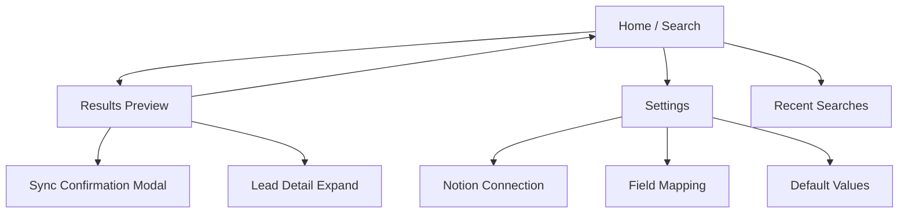
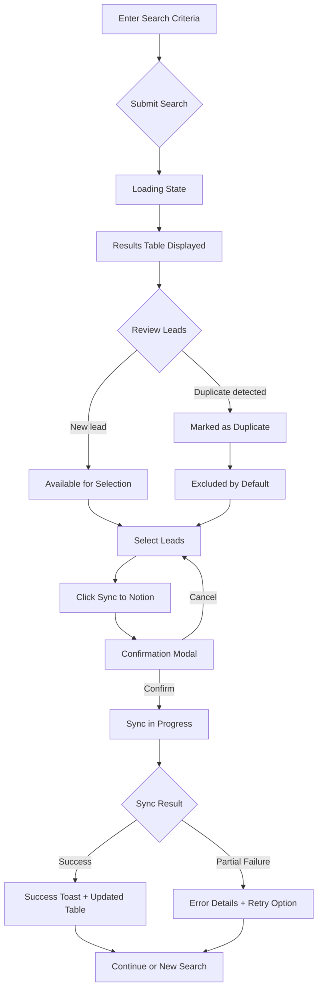
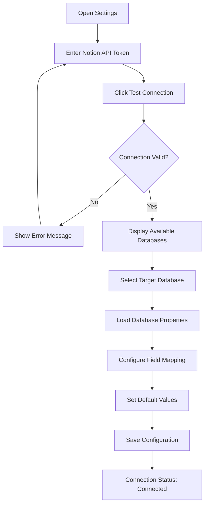
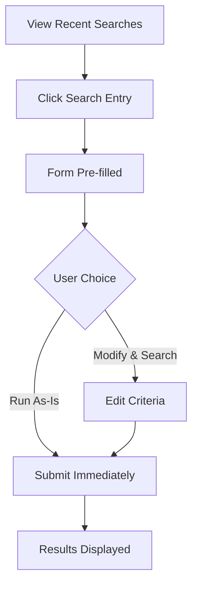

# Lead Scraper UI/UX Specification

This document defines the user experience goals, information architecture, user flows, and visual design specifications for Lead Scraper's user interface. It serves as the foundation for visual design and frontend development, ensuring a cohesive and user-centered experience.

---

## Overall UX Goals & Principles

### Target User Personas

**Solo Professional:** Entrepreneur, freelancer, consultant, or sales professional who currently relies on manual research and spreadsheets. Needs cost-effective lead generation without enterprise tool complexity. Values speed, reliability, and direct Notion integration over advanced features. Comfortable with developer tools and Docker.

### Usability Goals

1. **Speed of execution:** Complete search-to-sync workflow in under 3 minutes
2. **Minimal learning curve:** New users productive within first session
3. **Transparency:** Clear visibility into what's being scraped, deduplicated, and synced
4. **Error resilience:** Graceful handling of failed scrapes with actionable feedback

### Design Principles

1. **Utility over aesthetics** - Function comes first; clean is beautiful
2. **Immediate feedback** - Every action shows its result instantly
3. **Single source of truth** - Notion is the database; UI is just the interface
4. **Progressive disclosure** - Advanced options hidden until needed
5. **Fail gracefully** - Errors explain themselves and suggest next steps

### Change Log

| Date | Version | Description | Author |
|------|---------|-------------|--------|
| 2026-02-10 | 0.1 | Initial UI/UX specification draft | Sally (UX Expert) |

---

## Information Architecture

### Site Map



### Navigation Structure

**Primary Navigation:** Minimal header with 3 links
- **Search** (Home) - Primary action, always accessible
- **Results** - Shows accumulated session results (disabled if empty)
- **Settings** - Notion connection and field mapping

**Secondary Navigation:** None required - utility tool with shallow hierarchy

**Breadcrumb Strategy:** Not needed - only 2 levels deep maximum

### Screen Inventory

| Screen | Purpose | Entry Point |
|--------|---------|-------------|
| Search (Home) | Enter search criteria, view recent searches | Direct URL `/` |
| Results Preview | Review discovered leads, select for sync | After successful scrape |
| Sync Confirmation | Final review before Notion sync | Modal from Results |
| Settings | Notion setup, field mapping, defaults | Nav link `/settings` |

---

## User Flows

### Flow 1: Search to Sync (Primary Flow)

**User Goal:** Discover leads from public sources and sync them to Notion database

**Entry Points:** Home page (`/`), Recent search click

**Success Criteria:** Selected leads appear in Notion database with correct field mapping



**Edge Cases & Error Handling:**
- **No results found:** Display "No leads found" message with suggestion to broaden criteria
- **Scrape timeout:** Show timeout error with retry button, partial results if available
- **Notion API error:** Display specific error, offer retry, don't lose selected leads
- **Rate limited:** Queue request, show "Please wait" with countdown

---

### Flow 2: First-Time Notion Setup

**User Goal:** Connect Notion account and configure field mapping

**Entry Points:** Settings page, First-run prompt if no connection

**Success Criteria:** Valid Notion connection with database selected and fields mapped



**Edge Cases & Error Handling:**
- **Invalid token:** Clear error message explaining token format/permissions needed
- **No databases found:** Explain Notion integration permissions, link to Notion docs
- **Property type mismatch:** Warn but allow (e.g., email to text field)

---

### Flow 3: Re-run Recent Search

**User Goal:** Quickly repeat a previous search without re-entering criteria

**Entry Points:** Recent searches list on home page

**Success Criteria:** Search form pre-filled, results displayed



**Notes:** Recent searches stored in browser session/localStorage, last 10 entries

---

## Wireframes & Mockups

**Primary Design Files:** Not applicable - using Pico CSS classless styling. Layouts defined in Jinja2 templates with semantic HTML.

### Key Screen Layouts

#### Search Screen (Home)

**Purpose:** Primary entry point for initiating lead discovery

**Key Elements:**
- Header with navigation (Search | Results | Settings)
- Connection status indicator (top-right corner)
- Search form with fields: URL input, Industry dropdown, Location, Keywords, Company size hints
- "Search" primary button
- Recent searches list below form (last 10, collapsible)

**Interaction Notes:**
- Form validates URL format client-side before submission
- Submit triggers loading state with spinner
- Recent search click pre-fills form
- Advanced options toggle reveals secondary fields

---

#### Results Preview Screen

**Purpose:** Display discovered leads for review and selection before Notion sync

**Key Elements:**
- Summary bar: "Found X leads (Y new, Z duplicates)"
- Data table with columns: Select (checkbox), Company, Email, Phone, Website, Source, Status
- Bulk actions: Select All New, Deselect All, Sync to Notion
- Row-level duplicate indicator (badge/icon)
- Expandable row for full lead details

**Interaction Notes:**
- Duplicates visually muted and unchecked by default
- Click row to expand inline detail panel
- "Sync to Notion" disabled until at least one lead selected
- Table sortable by column headers

---

#### Sync Confirmation Modal

**Purpose:** Final review and confirmation before pushing leads to Notion

**Key Elements:**
- Modal overlay with centered dialog
- Header: "Sync X Leads to Notion"
- Lead count summary
- Field mapping preview (table showing which lead fields map to which Notion properties)
- "Cancel" and "Confirm Sync" buttons
- Progress indicator during sync

**Interaction Notes:**
- Escape or click outside closes modal
- "Confirm Sync" triggers progress bar
- On completion: success message or error details with retry option
- Modal auto-closes on success after 2 seconds

---

#### Settings Screen

**Purpose:** Configure Notion connection, field mapping, and default values

**Key Elements:**
- Section 1: Notion Connection
  - API token input (password field)
  - "Test Connection" button
  - Connection status display
- Section 2: Database Selection
  - Dropdown of available databases (populated after successful connection)
- Section 3: Field Mapping
  - Table of scraped fields → Notion property dropdowns
  - Type compatibility indicators
- Section 4: Default Values
  - Status default (dropdown)
  - Priority default (dropdown)
  - Potential Value default (input)
- "Save Settings" button

**Interaction Notes:**
- Sections 2-4 disabled until connection validated
- "Test Connection" shows inline success/error feedback
- Field mapping warns on type mismatches but allows override
- Changes auto-save or explicit save based on preference

---

## Component Library / Design System

**Design System Approach:** Leverage Pico CSS classless framework with semantic HTML. No custom component library needed - Pico provides styling through HTML elements alone (forms, buttons, tables, dialogs). HTMX handles dynamic interactions without JavaScript component architecture.

### Core Components

#### Form Controls

**Purpose:** Input fields for search criteria and settings configuration

**Variants:** Text input, password input, URL input, dropdown select, textarea

**States:** Default, Focus, Disabled, Invalid (with error message), Loading

**Usage Guidelines:**
- Use semantic HTML5 input types (`type="url"`, `type="email"`)
- Wrap related inputs in `<fieldset>` with `<legend>`
- Place validation messages immediately after input
- Use `aria-describedby` to link inputs with error messages

---

#### Data Table

**Purpose:** Display lead results in scannable, sortable format

**Variants:** Basic table, Selectable rows (with checkboxes), Expandable rows

**States:** Empty, Loading (skeleton), Populated, Row hover, Row selected, Row expanded

**Usage Guidelines:**
- Use `<table>` with proper `<thead>`, `<tbody>`, `<th scope="col">`
- Checkbox column first, action column last
- Duplicate leads: apply `.secondary` class for muted appearance
- Sortable headers use `role="button"` with sort indicators

---

#### Button

**Purpose:** Trigger actions and navigation

**Variants:**
- Primary (solid): Main actions like "Search", "Sync to Notion"
- Secondary (outline): Cancel, alternative actions
- Contrast: High-visibility actions in modals

**States:** Default, Hover, Focus, Disabled, Loading (with spinner)

**Usage Guidelines:**
- Primary button limited to one per context
- Use `aria-busy="true"` during loading state
- Destructive actions require confirmation
- Button text describes action ("Sync 5 Leads" not just "Sync")

---

#### Modal Dialog

**Purpose:** Confirmation flows and focused interactions (sync confirmation)

**Variants:** Confirmation modal, Alert modal

**States:** Hidden, Open (with backdrop), Loading (during async operation)

**Usage Guidelines:**
- Use native `<dialog>` element for accessibility
- Trap focus within modal when open
- Close on Escape key and backdrop click
- Prevent body scroll when modal open

---

#### Toast / Notification

**Purpose:** Provide feedback on action completion

**Variants:** Success (green), Error (red), Warning (yellow), Info (blue)

**States:** Hidden, Entering, Visible, Exiting

**Usage Guidelines:**
- Position fixed at top-right of viewport
- Auto-dismiss success toasts after 4 seconds
- Error toasts require manual dismissal
- Stack multiple toasts vertically
- Include close button for all types

---

#### Status Indicator

**Purpose:** Show connection state and sync status

**Variants:** Connected (green dot), Disconnected (red dot), Syncing (animated), Error (red with icon)

**States:** Idle, Active/Processing

**Usage Guidelines:**
- Always visible in header for Notion connection status
- Use color + icon for accessibility (don't rely on color alone)
- Tooltip on hover explains current state
- Clicking status navigates to relevant settings

---

## Branding & Style Guide

**Design Philosophy:** No custom branding required. Lead Scraper adopts Pico CSS defaults with minimal overrides. The "brand" is the absence of brand—a tool that gets out of the way.

### Visual Identity

**Logo/Mark:** None. Application uses text title "Lead Scraper" in the default sans-serif font.

**Brand Voice:** Technical, direct, no marketing speak. Labels and messages use developer-friendly language.

---

### Color Palette

Pico CSS provides a complete color system with automatic dark mode support. No custom palette needed.

**Semantic Colors (Pico defaults):**

| Purpose | Light Mode | Dark Mode | Usage |
|---------|------------|-----------|-------|
| Primary | `--pico-primary` | Auto-adjusted | Buttons, links, focus states |
| Secondary | `--pico-secondary` | Auto-adjusted | Secondary buttons, muted text |
| Contrast | `--pico-contrast` | Auto-adjusted | High-visibility actions |
| Success | Green (`#2ecc71` range) | Auto-adjusted | Sync complete, connection valid |
| Error | Red (`#e74c3c` range) | Auto-adjusted | Failed syncs, invalid inputs |
| Warning | Yellow (`#f39c12` range) | Auto-adjusted | Duplicate detection, rate limits |

**Custom CSS Variables (if needed):**
```css
:root {
  --lead-duplicate-opacity: 0.6;
  --toast-success: var(--pico-ins-color);
  --toast-error: var(--pico-del-color);
}
```

---

### Typography

**Font Stack:** Pico CSS system font stack (no web fonts to load)

```css
/* Pico default - no customization needed */
font-family: system-ui, -apple-system, "Segoe UI", Roboto, "Helvetica Neue", Arial, sans-serif;
```

**Type Scale:**
- **h1:** Page titles (Search, Results, Settings) - Pico default sizing
- **h2:** Section headers within pages
- **h3:** Subsection headers (Field Mapping, Default Values)
- **Body:** Default paragraph text
- **Small:** Helper text, timestamps, metadata

**Monospace (for technical content):**
- API tokens display
- Source URLs
- Error codes

---

### Iconography

**Approach:** Minimal. Text labels preferred over icons. When icons necessary, use Unicode symbols or simple inline SVG.

**Icon Usage:**
| Context | Symbol | Fallback |
|---------|--------|----------|
| Connection status (good) | 🟢 or `●` | "Connected" text |
| Connection status (bad) | 🔴 or `●` | "Disconnected" text |
| Duplicate indicator | ⚠️ or `(dup)` | "Duplicate" badge |
| Sync success | ✓ | "Synced" text |
| Loading | CSS spinner | "Loading..." text |
| External link | ↗ | (none needed) |

**No icon library required.** Simple CSS-based or Unicode indicators sufficient for MVP.

---

### Spacing & Layout System

**Grid/Layout:** Pico CSS container with responsive padding. No custom grid system.

**Container Width:**
- Max-width: `1200px` (Pico default)
- Centered with auto margins
- Responsive padding at breakpoints

**Spacing Scale:** Use Pico's default spacing via semantic HTML structure.

| Element | Spacing | Implementation |
|---------|---------|----------------|
| Sections | Large gap | `<section>` elements |
| Form groups | Medium gap | `<fieldset>` or form structure |
| Inline elements | Small gap | Default inline spacing |
| Table cells | Pico default | `<td>` padding |

**Layout Patterns:**
- **Search page:** Single column, centered form
- **Results page:** Full-width table with fixed header
- **Settings page:** Stacked sections with clear separation
- **Modal:** Centered overlay, max-width 600px

---

## Accessibility Requirements

**Scope Decision:** Per PRD, accessibility is explicitly out of scope for MVP. Lead Scraper is a personal, single-user tool without public-facing requirements. However, Pico CSS provides baseline accessibility features automatically.

### Baseline Accessibility (Pico CSS Defaults)

The following accessibility features are included automatically through Pico CSS and semantic HTML:

| Feature | Implementation | Effort |
|---------|----------------|--------|
| Keyboard navigation | Native browser focus handling | Zero |
| Focus indicators | Pico provides visible focus states | Zero |
| Color contrast | Pico colors meet WCAG AA | Zero |
| Reduced motion | `prefers-reduced-motion` respected | Zero |
| Dark mode | `prefers-color-scheme` support | Zero |
| Screen reader basics | Semantic HTML structure | Minimal |

### Semantic HTML Requirements

To maintain baseline accessibility with zero additional effort:

1. **Use proper heading hierarchy** - h1 → h2 → h3, no skipping levels
2. **Label all form inputs** - Associate `<label>` with every `<input>`
3. **Use button elements** - `<button>` for actions, not clickable `<div>`
4. **Table structure** - `<thead>`, `<th scope="col">` for data tables
5. **Dialog element** - Native `<dialog>` for modals (handles focus trapping)

### ARIA Usage

**Minimal ARIA required:**

| Pattern | ARIA Attribute | Purpose |
|---------|---------------|---------|
| Loading buttons | `aria-busy="true"` | Indicate processing state |
| Form errors | `aria-describedby` | Link input to error message |
| Toast notifications | `role="alert"` | Announce to screen readers |
| Status indicator | `aria-label` | Describe connection state |

### Not Implemented (Out of Scope)

The following are explicitly not required for MVP:

- WCAG 2.1 AA full compliance audit
- Skip navigation links
- Comprehensive screen reader testing
- Alternative text for decorative elements
- Focus management beyond browser defaults
- Accessibility statement/documentation
- High contrast mode beyond Pico defaults

### Future Consideration

If Lead Scraper were to become a shared or commercial tool, the following would need attention:

- Full WCAG 2.1 AA compliance
- Automated accessibility testing (axe-core)
- Screen reader testing (VoiceOver, NVDA)
- Keyboard-only workflow testing

---

## Responsiveness Strategy

**Approach:** Desktop-first with responsive adjustments. Lead Scraper is optimized for desktop workflows but functional on tablet.

### Breakpoint Definitions

| Breakpoint | Width | Target Devices | Priority |
|------------|-------|----------------|----------|
| Desktop (default) | ≥1024px | Desktop browsers | Primary |
| Tablet | 768px - 1023px | iPad, tablets | Secondary |
| Mobile | <768px | Phones | Minimal support |

**Rationale:** Lead Scraper is a productivity tool used during work hours. Desktop is the primary context. Tablet support enables quick checks but not primary workflow.

---

### Layout Adaptations by Breakpoint

#### Desktop (≥1024px)
- Full-width container (max 1200px, centered)
- Results table displays all columns with fixed layout
- Settings page: side-by-side sections possible
- Modal dialogs: 600px max-width, centered

#### Tablet (768px - 1023px)
- Container with reduced horizontal padding
- Results table maintains all columns visible
- Text truncation with ellipsis for longer content
- Settings page: stacked sections
- Modals: 90% viewport width

#### Mobile (<768px)
- Minimal support - horizontal scroll acceptable
- Results table scrolls horizontally
- Navigation may collapse (hamburger optional for MVP)
- Form inputs stack vertically
- Modals: full-width with padding

---

### Table Responsiveness Strategy

**Primary Approach:** Vertical scroll with sticky header, all columns visible

Tables (especially Results Preview) use vertical scrolling with fixed column layout to ensure all data columns remain visible without horizontal scroll on desktop and tablet.

**Desktop/Tablet Implementation:**
```css
/* Results table - all columns visible, vertical scroll */
.results-table-wrapper {
  max-height: 70vh;
  overflow-y: auto;
}

.results-table {
  table-layout: fixed;
  width: 100%;
}

.results-table thead {
  position: sticky;
  top: 0;
  background: var(--pico-background-color);
  z-index: 1;
}

/* Column widths - adjust based on content priority */
.results-table th:nth-child(1) { width: 5%; }   /* Checkbox */
.results-table th:nth-child(2) { width: 20%; }  /* Company */
.results-table th:nth-child(3) { width: 20%; }  /* Email */
.results-table th:nth-child(4) { width: 12%; }  /* Phone */
.results-table th:nth-child(5) { width: 18%; }  /* Website */
.results-table th:nth-child(6) { width: 15%; }  /* Source */
.results-table th:nth-child(7) { width: 10%; }  /* Status */

/* Truncate long content */
.results-table td {
  overflow: hidden;
  text-overflow: ellipsis;
  white-space: nowrap;
}
```

**Mobile (<768px) - Horizontal scroll acceptable:**
```css
@media (max-width: 767px) {
  .results-table-wrapper {
    overflow-x: auto;
    -webkit-overflow-scrolling: touch;
  }

  .results-table {
    min-width: 600px; /* Force horizontal scroll */
  }
}
```

---

### Form Responsiveness

Forms adapt naturally through Pico CSS:

```css
/* Pico handles most form responsiveness automatically */
/* Only override for specific layouts */

@media (max-width: 767px) {
  /* Stack form actions on mobile */
  .form-actions {
    flex-direction: column;
  }

  .form-actions button {
    width: 100%;
    margin-bottom: 0.5rem;
  }
}
```

---

### Navigation Responsiveness

**Desktop/Tablet:** Horizontal nav links in header (Search | Results | Settings)

**Mobile:** Options for MVP:
1. **Simple approach:** Stack nav links vertically in header
2. **Progressive:** Hamburger menu (adds JS complexity)

**Recommendation:** Stack vertically on mobile for MVP - simpler, no JavaScript required.

---

### Touch Considerations

| Element | Desktop | Touch Devices |
|---------|---------|---------------|
| Buttons | Default size | Minimum 44x44px tap target |
| Table rows | Hover state | No hover; tap to expand |
| Checkboxes | Default | Larger touch area via label |
| Links | Default | Adequate spacing between |

**Implementation:** Pico CSS provides reasonable touch targets by default. Only override if specific issues arise during testing.

---

## Animation & Micro-interactions

**Philosophy:** Minimal, functional animation. Motion serves purpose (feedback, state change indication), never decoration. Respects `prefers-reduced-motion`.

---

### Loading States

| Context | Animation | Implementation |
|---------|-----------|----------------|
| Form submit | Button spinner | CSS animation, `aria-busy="true"` |
| Scrape in progress | Pulsing indicator | CSS keyframes on status text |
| Notion sync | Progress bar | HTML `<progress>` element |
| Page navigation | None | HTMX handles seamlessly |

**Button Loading Spinner:**
```css
button[aria-busy="true"]::before {
  content: "";
  display: inline-block;
  width: 1em;
  height: 1em;
  border: 2px solid currentColor;
  border-right-color: transparent;
  border-radius: 50%;
  animation: spin 0.6s linear infinite;
  margin-right: 0.5em;
}

@keyframes spin {
  to { transform: rotate(360deg); }
}
```

---

### State Transitions

| Transition | Duration | Easing | Purpose |
|------------|----------|--------|---------|
| Toast enter/exit | 200ms | ease-out | Smooth notification appearance |
| Modal open/close | 150ms | ease-in-out | Dialog transitions |
| Row expand | 200ms | ease-out | Detail panel reveal |
| Focus states | 0ms | none | Immediate response (accessibility) |

**Modal Transition:**
```css
dialog {
  opacity: 0;
  transform: scale(0.95);
  transition: opacity 150ms ease-in-out, transform 150ms ease-in-out;
}

dialog[open] {
  opacity: 1;
  transform: scale(1);
}
```

---

### Feedback Indicators

| Action | Feedback | Duration |
|--------|----------|----------|
| Button click | Native browser feedback | Instant |
| Checkbox toggle | Immediate state change | Instant |
| Sync success | Success toast | 4 seconds auto-dismiss |
| Sync error | Error toast | Manual dismiss required |
| Duplicate detected | Badge appears | Instant, persistent |

---

### Reduced Motion Support

All animations respect user preferences:

```css
@media (prefers-reduced-motion: reduce) {
  *,
  *::before,
  *::after {
    animation-duration: 0.01ms !important;
    animation-iteration-count: 1 !important;
    transition-duration: 0.01ms !important;
  }
}
```

**Note:** Pico CSS includes reduced motion support by default.

---

### HTMX Transitions

HTMX handles content swaps. Minimal custom transition needed:

```css
/* Subtle fade for HTMX content swaps */
.htmx-swapping {
  opacity: 0.5;
  transition: opacity 100ms ease-out;
}

.htmx-settling {
  opacity: 1;
  transition: opacity 100ms ease-in;
}
```

---

### Micro-interaction Summary

| Interaction | Animation | Notes |
|-------------|-----------|-------|
| Hover on table row | Background color shift | CSS only, Pico default |
| Focus on input | Border highlight | Pico default |
| Click primary button | Scale down briefly | Optional, native may suffice |
| Connection status change | Dot color transition | 200ms color fade |

**Guiding Principle:** If an animation doesn't provide meaningful feedback or improve comprehension, omit it.

---

## 10. Performance Considerations

This section defines frontend performance strategies optimized for Lead Scraper's server-rendered, HTMX-enhanced architecture. The $0 infrastructure constraint and utility-first design philosophy inform all decisions.

---

### Asset Loading Strategy

**Total Frontend Payload Target: ~26KB**

| Asset | Size | Loading |
|-------|------|---------|
| Pico CSS (minified) | ~10KB | `<link>` in `<head>` |
| HTMX (minified) | ~14KB | `<script>` end of `<body>` |
| Custom CSS | ~2KB | Inline in `<head>` or separate file |
| JavaScript | 0KB | No custom JS required |

```html
<!DOCTYPE html>
<html lang="en" data-theme="light">
<head>
  <meta charset="UTF-8">
  <meta name="viewport" content="width=device-width, initial-scale=1">
  <title>Lead Scraper</title>

  <!-- Critical CSS first -->
  <link rel="stylesheet" href="/static/pico.min.css">
  <style>
    /* Minimal custom overrides inline */
    .results-table-wrapper { max-height: 70vh; overflow-y: auto; }
  </style>
</head>
<body>
  <!-- Content -->

  <!-- HTMX at end - non-blocking -->
  <script src="/static/htmx.min.js"></script>
</body>
</html>
```

---

### Critical Rendering Path

**Optimization Strategy:**

1. **HTML First:** Server-rendered content visible without JS
2. **CSS in Head:** Single stylesheet blocks briefly but is small
3. **No Web Fonts:** System font stack = zero font loading delay
4. **HTMX Deferred:** Loads after initial paint, enhances progressively

**First Contentful Paint Target:** < 500ms on local Docker

```
Timeline:
0ms      - HTML request
~50ms    - HTML response (local Docker)
~100ms   - Pico CSS loaded
~150ms   - First Contentful Paint (form visible)
~200ms   - HTMX loaded (interactions enabled)
```

---

### Perceived Performance

**HTMX Loading States:**

Always show immediate feedback during network operations.

```html
<!-- Scrape button with loading state -->
<button
  type="submit"
  hx-indicator="#scrape-spinner"
  hx-disabled-elt="this">
  <span id="scrape-spinner" class="htmx-indicator">Scraping...</span>
  <span class="button-text">Start Scraping</span>
</button>

<style>
  .htmx-indicator { display: none; }
  .htmx-request .htmx-indicator { display: inline; }
  .htmx-request .button-text { display: none; }
</style>
```

**Streaming for Long Operations:**

For scraping operations that may take 10-30 seconds:

```python
# Server-side: Stream progress updates
@app.post("/scrape")
async def scrape(request: Request):
    async def generate():
        yield render_progress(0, "Starting...")
        # ... scraping logic with progress yields
        yield render_progress(100, "Complete")
        yield render_results(leads)

    return StreamingResponse(generate(), media_type="text/html")
```

```html
<!-- Client-side: HTMX streaming -->
<div hx-post="/scrape"
     hx-swap="innerHTML"
     hx-ext="stream">
  <!-- Progress updates replace content as they stream -->
</div>
```

---

### Data Table Performance

**Row Count Strategies:**

| Rows | Strategy | Rationale |
|------|----------|-----------|
| < 50 | Render all | No performance concern |
| 50-200 | Client pagination | HTMX `hx-swap` for page changes |
| > 200 | Server pagination | Fetch pages on demand |

**Deduplication Check Performance:**

```python
# Efficient batch checking against Notion
async def check_duplicates(leads: list[Lead]) -> dict[str, bool]:
    """
    Query Notion once with OR filter for all company names/domains.
    Returns dict mapping lead ID to duplicate status.
    """
    # Single API call vs. per-lead queries
    existing = await notion.query_database(
        database_id=config.database_id,
        filter={"or": [
            {"property": "Website", "url": {"contains": lead.domain}}
            for lead in leads
        ]}
    )
    # ... matching logic
```

---

### Caching Strategy

**Browser Caching:**

```python
# FastAPI static file caching
from fastapi.staticfiles import StaticFiles

app.mount("/static", StaticFiles(directory="static"), name="static")

# Add cache headers in production
@app.middleware("http")
async def add_cache_headers(request, call_next):
    response = await call_next(request)
    if request.url.path.startswith("/static/"):
        response.headers["Cache-Control"] = "public, max-age=31536000"
    return response
```

**No Application Caching Required:**
- Notion is source of truth (no local database)
- Scrape results are transient (session-only)
- Settings stored in environment variables

---

### Performance Monitoring

**Simple Logging Approach:**

```python
import time
import logging

logger = logging.getLogger(__name__)

async def scrape_with_timing(url: str):
    start = time.perf_counter()
    try:
        result = await scraper.fetch(url)
        elapsed = time.perf_counter() - start
        logger.info(f"Scrape completed", extra={
            "url": url,
            "duration_ms": round(elapsed * 1000),
            "success": True
        })
        return result
    except Exception as e:
        elapsed = time.perf_counter() - start
        logger.error(f"Scrape failed", extra={
            "url": url,
            "duration_ms": round(elapsed * 1000),
            "error": str(e)
        })
        raise
```

**No External Monitoring:** Consistent with $0 infrastructure constraint. Structured logging to stdout is sufficient for Docker debugging.

---

### Performance Budget Summary

| Metric | Target | Rationale |
|--------|--------|-----------|
| Total CSS | < 15KB | Pico + custom |
| Total JS | < 15KB | HTMX only |
| Time to Interactive | < 300ms | Local Docker |
| Scrape-to-Results | < 2 min | NFR1 requirement |
| Notion Sync (per lead) | < 500ms | API rate limits |

---

## 11. Next Steps

### Immediate Actions

1. **Review this specification with the PRD** - Ensure all FR1-FR10 functional requirements have corresponding UI patterns defined
2. **Validate HTMX patterns** - Prototype the scrape → results → sync flow with actual HTMX to verify interaction design
3. **Create base template structure** - Build `base.html` Jinja2 template with Pico CSS and HTMX includes
4. **Implement Search Screen first** - Story 1.2 delivers the initial UI; use this spec for reference
5. **Handoff to Design Architect** - Proceed to `docs/front-end-architecture.md` for component implementation details

---

### Design Handoff Checklist

| Item | Status | Notes |
|------|--------|-------|
| All user flows documented | ✅ Complete | 4 flows: Scrape, Settings, Preview, Sync |
| Component inventory complete | ✅ Complete | Form fields, tables, modals, status indicators |
| Accessibility requirements defined | ✅ Scoped | Personal tool, no WCAG compliance required |
| Responsive strategy clear | ✅ Complete | 768px breakpoint, vertical scroll tables |
| Brand guidelines incorporated | ✅ Complete | Pico defaults, system fonts, minimal custom |
| Performance goals established | ✅ Complete | ~26KB payload, <500ms FCP target |

---

### Architecture Decisions (Clarified)

**Session Storage Strategy:**
- Scraped results persist in browser storage (localStorage or sessionStorage)
- Results survive tab switching and page navigation
- Lazy load results when returning to Results screen
- Clear on explicit user action or successful Notion sync

**Error Handling Pattern:**
- Errors do NOT block scraping - continue to next URL/lead
- All errors logged to activity log
- Activity Monitor component displays real-time status:
  - "Scraping... 15 leads found, 3 errors"
  - Success count + error count visible throughout process
- Detailed error log accessible for review (expandable panel or separate view)

---

### Architect Handoff Prompt

Create the frontend architecture for Lead Scraper based on `docs/front-end-spec.md`. Key implementation details:
- **Stack:** Jinja2 templates + HTMX + Pico CSS (classless)
- **No component framework:** Server-rendered HTML with HTMX enhancement
- **Template structure:** Base template with nav, content blocks, and HTMX includes
- **Session persistence:** Browser storage for scraped results (survives tab switches)
- **Activity Monitor:** Real-time status component showing success/error counts
- **Focus areas:** Form handling patterns, HTMX partial responses, table rendering with deduplication indicators, modal/drawer patterns for sync confirmation

Deliver: Template hierarchy diagram, HTMX endpoint contracts, CSS architecture (minimal custom overrides), browser storage patterns, and Activity Monitor component design.

---

## 12. Checklist Results

*No dedicated UI/UX checklist exists in BMAD core. Self-assessment validation performed against document completeness and PRD alignment.*

### Document Completeness Assessment

| Section | Status | Notes |
|---------|--------|-------|
| Site Map & Navigation | ✅ Complete | 4 screens defined with clear navigation paths |
| Screen Designs | ✅ Complete | All 4 screens have wireframes with component specs |
| Shared Components | ✅ Complete | 8 reusable components documented |
| Responsive Design | ✅ Complete | Pico CSS breakpoints, mobile-first approach |
| Form Handling | ✅ Complete | Validation rules, error states, submission patterns |
| State Management | ✅ Complete | Browser storage strategy, HTMX state patterns |
| Typography & Styling | ✅ Complete | System fonts, Pico CSS defaults, minimal overrides |
| Accessibility | ⚪ N/A | Scoped out per PRD (personal tool) |
| Performance | ✅ Complete | Budget defined, optimization strategies documented |
| Next Steps | ✅ Complete | Architect handoff prompt provided |

### PRD Alignment Check

| PRD Requirement | UI/UX Coverage |
|-----------------|----------------|
| FR1: Search criteria via web interface | ✅ Search Screen with form inputs |
| FR7: Preview of discovered leads | ✅ Results Table with selection |
| FR10: Sync confirmation before push | ✅ Sync Confirmation modal/drawer |
| NFR1: Search-to-results < 2 min | ✅ Loading states, streaming design |
| UI Goals: Minimalist, utility-first | ✅ Pico CSS, no custom branding |
| UI Goals: Table-based results | ✅ Results Table component |
| UI Goals: Progressive disclosure | ✅ Collapsible advanced options |

### Identified Gaps (Minor)

1. **Empty state designs** - Not explicitly wireframed (use Pico defaults)
2. **Keyboard shortcuts** - Not specified (not required for MVP)
3. **Print styles** - Not covered (not a use case)

### Final Assessment

**Document Status: COMPLETE**

The UI/UX Specification is ready for Architect handoff. All core screens, components, and interaction patterns are documented. The design aligns with PRD requirements for a utility-first, developer-tool aesthetic using Pico CSS and HTMX.

---

